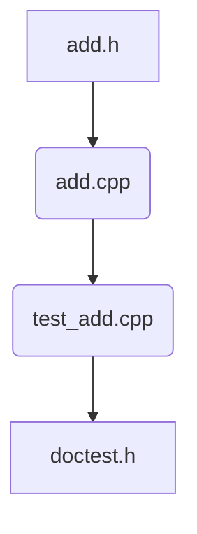

# add 算子架构文档

## 引言

本文档描述了 `add` 算子的架构设计，包括头文件、源码文件和测试用例文件的组织结构。该算子是一个简单的加法函数，接受两个 `int` 类型参数，并返回它们的和。整个项目使用 C++11 标准编写，且不使用异常处理。

## 技术栈

- **编程语言:** C++11
- **编译器:** g++
- **编译命令:** `g++ -std=c++11 -I/path/to/doctest test_add.cpp add.cpp -o test_add`
- **运行命令:** `./test_add`
- **测试框架:** doctest (v2.4.8)

## 文件结构

### 头文件查找目录 (include)

- **头文件:** `add.h`
  - 包含 `add` 函数的声明。
  - 不包含任何实现代码。

### 源码目录 (src)

- **源码文件:** `add.cpp`
  - 实现 `add` 函数。
  - 使用 C++11 标准编写。
  - 不使用异常处理。

### 测试用例目录 (tests)

- **测试文件:** `test_add.cpp`
  - 使用 doctest 框架编写测试用例。
  - 包含 `DOCTEST_CONFIG_IMPLEMENT_WITH_MAIN` 宏定义。
  - 测试用例包括基本功能测试和溢出测试。

## 开发注意事项

- **doctest 使用:** 在 `test_add.cpp` 文件中增加 `DOCTEST_CONFIG_IMPLEMENT_WITH_MAIN` 宏定义，确保测试框架正确初始化。
- **溢出测试:** 测试用例中包含对 `INT_MAX + 1` 和 `INT_MIN - 1` 的处理，确保函数在溢出情况下返回正确的结果。
- **禁止使用非法表达式:** 禁止使用 `INT_MIN - 1` 或 `INT_MAX + 1` 表达式，需使用类型转换如 `static_cast<long long>(INT_MAX) + 1`。
- **编译和运行:** 使用 `g++` 编译器编译源码和测试文件，生成可执行文件 `test_add` 并运行测试。

## 架构图

## 下一步

- 实现 `add` 函数的源码。
- 编写完整的测试用例，确保覆盖所有边界情况。
- 使用 `make` 工具管理编译过程。
- 验证测试用例的正确性，确保所有测试通过。