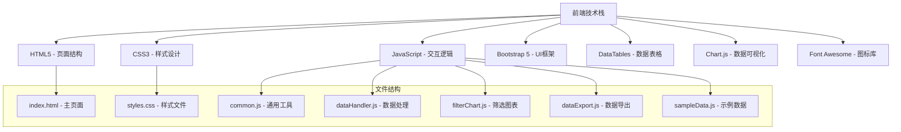
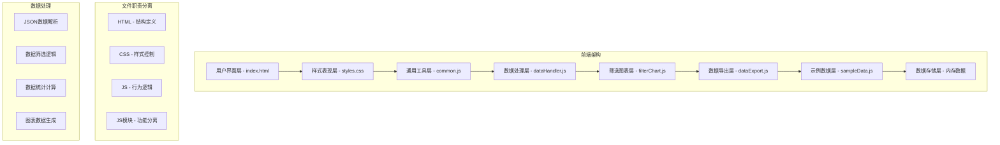

# 大模型性能基准测试数据展示系统 - 设计文档

## 1. 系统概述

### 1.1 设计目标
创建一个基于Web的大模型性能基准测试数据展示系统，专为PC大屏设计，支持多种推理框架的性能数据对比分析，提供直观的数据筛选、展示和对比功能。

### 1.2 核心特性
- **左右布局设计**: 左侧筛选面板，右侧主内容区域
- **多维度数据筛选**: 支持模型、框架、序列长度等维度筛选
- **实时数据展示**: 使用DataTables实现高性能数据表格
- **可视化对比**: 使用Chart.js实现多维度性能对比图表
- **外部数据加载**: 支持JSON格式数据文件导入
- **PC大屏优化**: 专为PC大屏设计，最大化数据展示空间

## 2. 技术架构设计

### 2.1 技术栈选择


### 2.2 文件分离架构
系统采用模块化的前端架构，将JavaScript功能拆分为多个专门的模块文件：

**文件结构说明：**
- **index.html**: 主页面文件，负责页面结构和布局
  - 使用Bootstrap网格系统实现左右布局
  - 包含所有UI组件的HTML结构
  - 通过CDN引入外部库资源
  - 引入所有JavaScript模块文件

- **styles.css**: 样式文件，负责页面外观和视觉效果
  - 自定义CSS样式，覆盖Bootstrap默认样式
  - 响应式设计，适配不同屏幕尺寸
  - 组件化样式设计，便于维护和扩展

- **common.js**: 通用工具函数模块
  - 提供全局共享的工具函数
  - 包含通用的辅助方法

- **dataHandler.js**: 数据处理模块
  - 负责数据加载、解析和处理
  - 管理内存中的数据状态

- **filterChart.js**: 筛选和图表模块
  - 实现数据筛选功能
  - 负责图表生成和更新

- **dataExport.js**: 数据导出模块
  - 提供数据导出功能
  - 支持多种格式的数据导出

- **sampleData.js**: 示例数据模块
  - 提供示例数据用于演示
  - 支持离线测试和开发

### 2.3 架构组件


## 3. UI界面设计

### 3.1 布局结构
```html
<div class="container-fluid">
    <div class="row">
        <!-- 左侧筛选面板 -->
        <div class="col-md-2 sidebar p-2">
            <div class="p-2">
                <h5 class="mb-3">
                    <i class="fas fa-filter me-1"></i>数据筛选
                </h5>
                    
                    <!-- 数据加载区域 -->
                    <div class="filter-section">
                        <h6 class="mb-1">数据加载</h6>
                        <div class="mb-2">
                            <label for="dataFile" class="form-label filter-label">选择数据文件</label>
                            <input type="file" class="form-control" id="dataFile" accept=".json">
                        </div>
                        <button class="btn btn-primary w-100 btn-sm" onclick="loadData()">
                            <i class="fas fa-upload me-1"></i>加载数据
                        </button>
                    </div>
                    
                    <!-- 模型筛选 -->
                    <div class="filter-section">
                        <h6 class="mb-1">模型筛选</h6>
                        <div class="mb-2">
                            <label for="modelFilter" class="form-label filter-label">模型名称</label>
                            <select class="form-select filter-select" id="modelFilter">
                                <option value="">全部</option>
                            </select>
                        </div>
                    
                    <!-- 框架筛选 -->
                    <div class="filter-section">
                        <h6 class="mb-1">框架筛选</h6>
                        <div class="mb-2">
                            <label for="frameworkFilter" class="form-label filter-label">推理框架</label>
                            <select class="form-select filter-select" id="frameworkFilter">
                                <option value="">全部</option>
                            </select>
                        </div>
                    </div>
                    
                    <!-- 序列长度筛选 -->
                    <div class="filter-section">
                        <h6 class="mb-1">序列长度</h6>
                        <div class="mb-2">
                            <label for="inputSeqFilter" class="form-label filter-label">输入序列长度</label>
                            <input type="range" class="form-range" id="inputSeqFilter" min="0" max="1000" step="100">
                            <small class="text-muted">当前: <span id="inputSeqValue">0</span></small>
                        </div>
                        <div class="mb-3">
                            <label for="outputSeqFilter" class="form-label filter-label">输出序列长度</label>
                            <input type="range" class="form-range" id="outputSeqFilter" min="0" max="100" step="100">
                            <small class="text-muted">当前: <span id="outputSeqValue">0</span></small>
                        </div>
                    </div>
                    
                    <!-- 指标筛选 -->
                    <div class="filter-section">
                        <h6 class="mb-1">显示指标</h6>
                        <div class="form-check">
                            <input class="form-check-input" type="checkbox" id="showPrefill" checked>
                            <label class="form-check-label" for="showPrefill">Prefill耗时 (ms)</label>
                        </div>
                        <div class="form-check">
                            <input class="form-check-input" type="checkbox" id="showDecode" checked>
                            <label class="form-check-label" for="showDecode">Decode耗时 (ms)</label>
                        </div>
                        <div class="form-check">
                            <input class="form-check-input" type="checkbox" id="showTotal" checked>
                            <label class="form-check-label" for="showTotal">总耗时 (ms)</label>
                        </div>
                        <div class="form-check">
                            <input class="form-check-input" type="checkbox" id="showTPS" checked>
                            <label class="form-check-label" for="showTPS">Token/s</label>
                        </div>
                    </div>
                    
                    <button class="btn btn-secondary w-100 btn-sm" onclick="resetFilters()">
                        <i class="fas fa-undo me-1"></i>重置筛选
                    </button>
                </div>
            </div>
            
            <!-- 主内容区域 -->
            <div class="col-md-10 p-2">
                <div class="main-content p-3">
                    <!-- 顶部导航 -->
                    <div class="d-flex justify-content-between align-items-center mb-5">
                        <h1 class="h4 mb-0">
                            <i class="fas fa-chart-line me-1"></i>大模型性能基准测试数据
                        </h1>
                        <div class="d-flex gap-2">
                            <button class="btn btn-outline-primary btn-sm" onclick="showComparison()">
                                <i class="fas fa-chart-bar me-1"></i>对比分析
                            </button>
                            <button class="btn btn-outline-success btn-sm" onclick="exportData()">
                                <i class="fas fa-download me-1"></i>导出数据
                            </button>
                        </div>
                        
                        <!-- 统计卡片 -->
                    <div class="row mb-5">
                        <div class="col-md-3">
                            <div class="metric-card">
                                <div class="metric-value" id="totalBenchmarks">0</div>
                                <div class="metric-label">总测试数</div>
                            </div>
                        </div>
                        <div class="col-md-3">
                            <div class="metric-card">
                                <div class="metric-value" id="avgPrefill">0</div>
                                <div class="metric-label">平均Prefill (ms)</div>
                            </div>
                        </div>
                        <div class="col-md-3">
                            <div class="metric-card">
                                <div class="metric-value" id="avgDecode">0</div>
                                <div class="metric-label">平均Decode (ms)</div>
                            </div>
                        <div class="col-md-3">
                            <div class="metric-card">
                                <div class="metric-value" id="avgTPS">0</div>
                                <div class="metric-label">平均Token/s</div>
                            </div>
                        </div>
                    </div>
                    
                    <!-- 数据表格 -->
                    <div class="p-5">
                        <h5 class="mb-2">性能数据详情</h5>
                        <div class="table-responsive">
                            <table id="performanceTable" class="table table-striped table-hover data-table">
                                <thead>
                                    <tr>
                                        <th>模型</th>
                                        <th>框架</th>
                                        <th>输入序列</th>
                                        <th>输出序列</th>
                                        <th>Prefill (ms)</th>
                                        <th>Decode (ms)</th>
                                        <th>总耗时 (ms)</th>
                                        <th>Token/s</th>
                                        <th>内存 (MB)</th>
                                        <th>吞吐量</th>
                                    </tr>
                                </thead>
                                <tbody>
                                    <!-- 数据将通过JavaScript动态加载 -->
                                </tbody>
                            </table>
                        </div>
                    </div>
                    
                    <!-- 对比分析图表 -->
                    <div class="p-5" id="comparisonSection" style="display: none;">
                        <h5 class="mb-2">对比分析</h5>
                        <div class="row">
                            <div class="col-md-6">
                                <div class="chart-container">
                                    <canvas id="frameworkComparisonChart"></canvas>
                                </div>
                            </div>
                            <div class="col-md-6">
                                <div class="chart-container">
                                    <canvas id="modelComparisonChart"></canvas>
                                </div>
                            </div>
                        </div>
                    </div>
                </div>
            </div>
        </div>
    </div>
</div>
```

### 3.2 核心样式设计
```css
/* 侧边栏样式 - 专为PC大屏优化 */
.sidebar {
    background-color: #ffffff;
    min-height: 100vh;
    box-shadow: 0.125rem 0.25rem rgba(0, 0, 0, 0.075);
    padding: 0.125rem !important;
}

/* 主内容区域样式 - 最大化数据展示空间 */
.main-content {
    background-color: #ffffff;
    border-radius: 0.25rem;
    box-shadow: 0 0.125rem 0.25rem rgba(0, 0, 0.075);
    margin-bottom: 0.5rem;
    padding: 1.5rem !important;
}

.filter-section {
    border-bottom: 1px solid #dee2e6;
    padding-bottom: 0.25rem;
    margin-bottom: 0.25rem;
}

.filter-section:last-child {
    border-bottom: none;
    margin-bottom: 0;
}

/* 图表容器样式 - 最大化显示空间 */
.chart-container {
    position: relative;
    height: 450px;
    margin-top: 1rem;
}

.data-table {
    font-size: 14px;
    margin-top: 1.5rem;
}

.data-table th {
    background-color: #f8f9fa;
    font-weight: 600;
    padding: 0.75rem;
}

.data-table td {
    padding: 0.75rem;
}

.loading-spinner {
    display: none;
    position: fixed;
    top: 50%;
    left: 50%;
    transform: translate(-50%, -50%);
    z-index: 9999;
}

/* 统计卡片样式 - 优化大屏显示 */
.metric-card {
    background-color: #f8f9fa;
    border-radius: 0.25rem;
    padding: 1rem;
    margin-bottom: 1rem;
    border-left: 3px solid #0d6efd;
}

.metric-card:hover {
    transform: translateY(-2px);
    box-shadow: 0 4px 8px rgba(0, 0, 0, 0.1);
}

.metric-value {
    font-size: 1.25rem;
    font-weight: bold;
    color: #0d6efd;
}

.metric-label {
    font-size: 0.75rem;
    color: #6c757d;
    margin-top: 0.25rem;
}

/* 顶部导航样式 */
.navbar {
    background-color: #ffffff;
    border-bottom: 1px solid #dee2e6;
    padding: 1rem 0;
    margin-bottom: 2rem;
}

.navbar h1 {
    font-size: 1.25rem;
    font-weight: 600;
    color: #212529;
}

/* 按钮样式优化 */
.btn {
    padding: 0.375rem 0.75rem;
    font-weight: 500;
    border-radius: 0.375rem;
    transition: all 0.2s ease;
    margin-bottom: 0.5rem;
}

.btn:hover {
    transform: translateY(-1px);
    box-shadow: 0 2px 4px rgba(0, 0, 0, 0.1);
}

/* 筛选器样式 */
.form-control, .form-select {
    border: 1px solid #ced4da;
    border-radius: 0.375rem;
    padding: 0.5rem;
    transition: border-color 0.2s ease;
}

/* 筛选器下拉框样式 */
.filter-select {
    width: 100%;
    margin-bottom: 0.25rem;
    font-size: 0.85rem;
    padding: 0.25rem 0.5rem;
}

.form-control:focus, .form-select:focus {
    border-color: #0d6efd;
    box-shadow: 0 0 0.2rem rgba(13, 110, 253, 0.25);
}

/* 滑块样式 */
.form-range {
    height: 0.4rem;
}

.form-range::-webkit-slider-thumb {
    width: 1rem;
    height: 1rem;
    background-color: #0d6efd;
    border: 0;
    border-radius: 50%;
    cursor: pointer;
}

/* 复选框样式 */
.form-check-input {
    width: 1rem;
    height: 1rem;
    margin-top: 0.25rem;
}

.form-check-label {
    font-weight: 500;
    color: #495057;
    margin-bottom: 0.25rem;
}

/* 区分输入属性和性能数据的颜色样式 */
.input-attribute {
    background-color: #e3f2fd;
    font-weight: 500;
}

.performance-data {
    background-color: #fff3e0;
    font-weight: 500;
}

/* 不同框架的性能数据颜色区分 */
.framework-tensorrt {
    background-color: #e3f2fd;
}

.framework-vllm {
    background-color: #f1f8e9;
}

.framework-llamacpp {
    background-color: #fff3e0;
}

.framework-mlc {
    background-color: #fce4ec;
}

.framework-onnx {
    background-color: #e8f5e8;
}

.framework-pytorch {
    background-color: #fff0f0;
}

/* 响应式设计优化 */
@media (max-width: 768px) {
    .sidebar {
        width: 100%;
        max-width: none;
        min-width: auto;
        height: auto;
        position: relative;
    }
    
    .main-content {
        width: 100%;
        padding: 1rem;
    }
    
    .metric-card {
        padding: 1rem;
        margin-bottom: 1rem;
    }
    
    .metric-value {
        font-size: 1.5rem;
    }
    
    .chart-container {
        height: 300px;
    }
}

/* 加载状态样式 */
.loading-spinner.show {
    display: block;
}

/* 表格行样式优化 */
.data-table tr:hover {
    background-color: #f8f9fa;
}

.table-responsive {
    margin-top: 1rem;
}

/* 筛选器标签样式 */
.filter-label {
    font-weight: 600;
    margin-bottom: 0.25rem;
    color: #495057;
}

/* 按钮组样式 */
.btn-group {
    margin-bottom: 1rem;
}

/* 卡片标题样式 */
.card-title {
    font-weight: 600;
    color: #212529;
    margin-bottom: 0.125rem;
}
```

## 4. 数据格式设计

### 4.1 JSON数据结构
```json
{
  "metadata": {
    "version": "1.0",
    "created_at": "2024-01-15T10:00:00Z",
    "description": "大模型性能基准测试数据"
  },
  "benchmarks": [
    {
      "id": "benchmark_001",
      "model_name": "GPT-4",
      "model_version": "4.0",
      "framework": "TensorRT",
      "framework_version": "8.6",
      "hardware": "NVIDIA A100",
      "input_sequence": 1024,
      "output_sequence": 512,
      "metrics": {
        "prefill_time_ms": 45.2,
        "decode_time_ms": 12.8,
        "total_time_ms": 58.0,
        "tokens_per_second": 88.3,
        "memory_usage_mb": 2450,
        "throughput": 92.1
      },
      "timestamp": "2024-01-15T09:30:00Z",
      "environment": {
        "cuda_version": "11.8",
        "python_version": "3.9",
        "os": "Ubuntu 20.04"
      }
    }
  ]
}
```

### 4.2 数据字段说明
| 字段 | 类型 | 描述 |
|------|------|------|
| model_name | string | 模型名称 |
| framework | string | 推理框架 |
| input_sequence | number | 输入序列长度 |
| output_sequence | number | 输出序列长度 |
| metrics | object | 性能指标对象 |
| prefill_time_ms | number | Prefill耗时（毫秒） |
| decode_time_ms | number | Decode耗时（毫秒） |
| total_time_ms | number | 总耗时（毫秒） |
| tokens_per_second | number | Token处理速度 |
| memory_usage_mb | number | 内存使用量（MB） |
| throughput | number | 吞吐量 |

## 5. 核心功能实现

### 5.1 数据加载功能
```javascript
// 加载数据文件
function loadData() {
    const fileInput = document.getElementById('dataFile');
    const file = fileInput.files[0];
    
    if (!file) {
        alert('请选择数据文件');
        return;
    }
    
    const reader = new FileReader();
    reader.onload = function(e) {
        try {
            const data = JSON.parse(e.target.result);
            processData(data);
        } catch (error) {
            alert('数据文件格式错误: ' + error.message);
        }
    };
    reader.readAsText(file);
}

// 处理数据
function processData(data) {
    if (!data.benchmarks || !Array.isArray(data.benchmarks)) {
        alert('数据格式不正确');
        return;
    }
    
    performanceData = data.benchmarks;
    updateTable();
    updateStatistics();
    updateFilters();
}
```

### 5.2 数据表格初始化
```javascript
// 初始化数据表格
function initializeDataTable() {
    dataTable = $('#performanceTable').DataTable({
        responsive: true,
        pageLength: 10,
        language: {
            url: '//cdn.datatables.net/plug-ins/1.13.6/i18n/zh.json'
        },
        columns: [
            { title: '模型' },
            { title: '框架' },
            { title: '输入序列' },
            { title: '输出序列' },
            { title: 'Prefill (ms)' },
            { title: 'Decode (ms)' },
            { title: '总耗时 (ms)' },
            { title: 'Token/s' },
            { title: '内存 (MB)' },
            { title: '吞吐量' }
        ]
    });
}

// 更新表格数据
function updateTable() {
    dataTable.clear();
    
    performanceData.forEach(item => {
        const row = [
            item.model_name,
            item.framework,
            item.input_sequence,
            item.output_sequence,
            item.metrics.prefill_time_ms.toFixed(2),
            item.metrics.decode_time_ms.toFixed(2),
            item.metrics.total_time_ms.toFixed(2),
            item.metrics.tokens_per_second.toFixed(2),
            item.metrics.memory_usage_mb,
            item.metrics.throughput
        ];
        dataTable.row.add(row);
    });
    
    dataTable.draw();
}
```

### 5.3 数据筛选功能
```javascript
// 应用筛选
function applyFilters() {
    const modelFilter = document.getElementById('modelFilter').value;
    const frameworkFilter = document.getElementById('frameworkFilter').value;
    const inputSeqFilter = parseInt(document.getElementById('inputSeqFilter').value);
    const outputSeqFilter = parseInt(document.getElementById('outputSeqFilter').value);
    
    dataTable.clear();
    
    performanceData.forEach(item => {
        let include = true;
        
        if (modelFilter && item.model_name !== modelFilter) include = false;
        if (frameworkFilter && item.framework !== frameworkFilter) include = false;
        if (inputSeqFilter > 0 && item.input_sequence > inputSeqFilter) include = false;
        if (outputSeqFilter > 0 && item.output_sequence > outputSeqFilter) include = false;
        
        if (include) {
            const row = [
                item.model_name,
                item.framework,
                item.input_sequence,
                item.output_sequence,
                item.metrics.prefill_time_ms.toFixed(2),
                item.metrics.decode_time_ms.toFixed(2),
                item.metrics.total_time_ms.toFixed(2),
                item.metrics.tokens_per_second.toFixed(2),
                item.metrics.memory_usage_mb,
                item.metrics.throughput
            ];
            dataTable.row.add(row);
        }
    });
    
    dataTable.draw();
}

// 更新筛选器选项
function updateFilters() {
    const models = [...new Set(performanceData.map(item => item.model_name))];
    const frameworks = [...new Set(performanceData.map(item => item.framework))];
    
    updateSelectOptions('modelFilter', models);
    updateSelectOptions('frameworkFilter', frameworks);
}

// 更新选择器选项
function updateSelectOptions(selectId, options) {
    const select = document.getElementById(selectId);
    select.innerHTML = '<option value="">全部</option>';
    
    options.forEach(option => {
        const optionElement = document.createElement('option');
        optionElement.value = option;
        optionElement.textContent = option;
        select.appendChild(optionElement);
    });
}
```

### 5.4 统计信息计算
```javascript
// 更新统计信息
function updateStatistics() {
    const total = performanceData.length;
    const avgPrefill = performanceData.reduce((sum, item) => sum + item.metrics.prefill_time_ms, 0) / total;
    const avgDecode = performanceData.reduce((sum, item) => sum + item.metrics.decode_time_ms, 0) / total;
    const avgTPS = performanceData.reduce((sum, item) => sum + item.metrics.tokens_per_second, 0) / total;
    
    document.getElementById('totalBenchmarks').textContent = total;
    document.getElementById('avgPrefill').textContent = avgPrefill.toFixed(2);
    document.getElementById('avgDecode').textContent = avgDecode.toFixed(2);
    document.getElementById('avgTPS').textContent = avgTPS.toFixed(2);
}
```

### 5.5 对比图表生成
```javascript
// 创建对比图表
function createComparisonCharts() {
    // 框架对比图表
    const frameworkCtx = document.getElementById('frameworkComparisonChart').getContext('2d');
    const frameworkData = getFrameworkComparisonData();
    
    if (frameworkChart) {
        frameworkChart.destroy();
    }
    
    frameworkChart = new Chart(frameworkCtx, {
        type: 'bar',
        data: frameworkData,
        options: {
            responsive: true,
            maintainAspectRatio: false,
            plugins: {
                title: {
                    display: true,
                    text: '不同框架性能对比'
                }
            },
            scales: {
                y: {
                    beginAtZero: true,
                    title: {
                        display: true,
                        text: '耗时 (ms)'
                    }
                }
            }
        }
    });
    
    // 模型对比图表
    const modelCtx = document.getElementById('modelComparisonChart').getContext('2d');
    const modelData = getModelComparisonData();
    
    if (modelChart) {
        modelChart.destroy();
    }
    
    modelChart = new Chart(modelCtx, {
        type: 'bar',
        data: modelData,
        options: {
            responsive: true,
            maintainAspectRatio: false,
            plugins: {
                title: {
                    display: true,
                    text: '不同模型性能对比'
                }
            },
            scales: {
                y: {
                    beginAtZero: true,
                    title: {
                        display: true,
                        text: 'Token/s'
                    }
                }
            }
        }
    });
}

// 获取框架对比数据
function getFrameworkComparisonData() {
    const frameworks = [...new Set(performanceData.map(item => item.framework))];
    const datasets = [
        {
            label: 'Prefill耗时',
            data: frameworks.map(framework => {
                const items = performanceData.filter(item => item.framework === framework);
                return items.reduce((sum, item) => sum + item.metrics.prefill_time_ms, 0) / items.length;
            }),
            backgroundColor: 'rgba(54, 162, 235, 0.8)'
        },
        {
            label: 'Decode耗时',
            data: frameworks.map(framework => {
                const items = performanceData.filter(item => item.framework === framework);
                return items.reduce((sum, item) => sum + item.metrics.decode_time_ms, 0) / items.length;
            }),
            backgroundColor: 'rgba(255, 99, 132, 0.8)'
        }
    ];
    
    return {
        labels: frameworks,
        datasets: datasets
    };
}

// 获取模型对比数据
function getModelComparisonData() {
    const models = [...new Set(performanceData.map(item => item.model_name))];
    const datasets = [
        {
            label: 'Token/s',
            data: models.map(model => {
                const items = performanceData.filter(item => item.model_name === model);
                return items.reduce((sum, item) => sum + item.metrics.tokens_per_second, 0) / items.length;
            }),
            backgroundColor: 'rgba(75, 192, 192, 0.8)'
        }
    ];
    
    return {
        labels: models,
        datasets: datasets
    };
}
```

### 5.6 数据导出功能
```javascript
// 导出数据
function exportData() {
    const csvContent = generateCSV();
    const blob = new Blob([csvContent], { type: 'text/csv;charset=utf-8;' });
    const link = document.createElement('a');
    const url = URL.createObjectURL(blob);
    
    link.setAttribute('href', url);
    link.setAttribute('download', 'performance_data.csv');
    link.style.visibility = 'hidden';
    
    document.body.appendChild(link);
    link.click();
    document.body.removeChild(link);
}

// 生成CSV内容
function generateCSV() {
    const headers = ['模型', '框架', '输入序列', '输出序列', 'Prefill耗时(ms)', 'Decode耗时(ms)', '总耗时(ms)', 'Token/s', '内存(MB)', '吞吐量'];
    const rows = performanceData.map(item => [
        item.model_name,
        item.framework,
        item.input_sequence,
        item.output_sequence,
        item.metrics.prefill_time_ms,
        item.metrics.decode_time_ms,
        item.metrics.total_time_ms,
        item.metrics.tokens_per_second,
        item.metrics.memory_usage_mb,
        item.metrics.throughput
    ]);
    
    return [headers, ...rows].map(row => row.join(',')).join('\n');
}
```

## 6. 性能优化策略

### 6.1 数据处理优化
- 使用Set进行去重操作，提高筛选效率
- 采用批量更新策略，减少DOM操作次数
- 使用DataTables的分页功能，避免一次性渲染大量数据

### 6.2 图表渲染优化
- 图表实例复用，避免重复创建
- 使用requestAnimationFrame进行动画渲染
- 图表数据预计算，减少实时计算开销

### 6.3 内存管理
- 及时销毁不再使用的图表实例
- 避免内存泄漏，合理管理事件监听器
- 使用事件委托减少事件监听器数量

## 7. 扩展性设计

### 7.1 模块化架构
```javascript
// 数据处理模块
const DataProcessor = {
    loadData: function(file) { /* ... */ },
    processData: function(data) { /* ... */ },
    filterData: function(filters) { /* ... */ },
    calculateStatistics: function(data) { /* ... */ }
};

// 图表模块
const ChartManager = {
    createFrameworkChart: function(data) { /* ... */ },
    createModelChart: function(data) { /* ... */ },
    updateCharts: function() { /* ... */ }
};

// 导出模块
const ExportManager = {
    exportToCSV: function(data) { /* ... */ },
    exportToJSON: function(data) { /* ... */ }
};
```

### 7.2 配置化设计
```javascript
// 配置文件
const Config = {
    table: {
        pageLength: 10,
        language: 'zh.json'
    },
    chart: {
        responsive: true,
        maintainAspectRatio: false
    },
    filter: {
        defaultValues: {
            model: '',
            framework: '',
            inputSeq: 0,
            outputSeq: 0
        }
    }
};
```

## 8. 测试策略

### 8.1 功能测试
- 数据加载测试
- 筛选功能测试
- 图表展示测试
- 数据导出测试

### 8.2 性能测试
- 大数据量加载测试
- 筛选响应时间测试
- 图表渲染性能测试

### 8.3 兼容性测试
- 浏览器兼容性测试
- 响应式设计测试
- 移动端适配测试

## 9. 部署说明

### 9.1 部署要求
- 支持HTML5的现代浏览器
- 网络连接（用于加载CDN资源）
- 无需服务器，可直接在浏览器中运行

### 9.2 部署步骤
1. 将项目文件部署到Web服务器
2. 确保CDN资源可访问
3. 配置正确的MIME类型
4. 测试功能完整性

## 10. 总结

本设计文档详细介绍了大模型性能基准测试数据展示系统的设计方案，包括技术架构、UI设计、数据格式、核心功能实现等方面。系统采用左右布局设计，左侧筛选面板，右侧主内容区域，提供了直观易用的用户界面。通过DataTables和Chart.js等现代前端技术，实现了高性能的数据展示和可视化对比功能。

系统的核心优势包括：
- **文件分离架构**: HTML+CSS+JS三分离，职责清晰，便于维护
- **无需编译**: 纯前端实现，直接在浏览器中运行
- **多维度筛选**: 支持模型、框架、序列长度等多维度筛选
- **可视化对比**: 提供直观的图表对比功能
- **响应式设计**: 适配不同设备屏幕尺寸
- **扩展性强**: 模块化设计，易于扩展和维护

**文件分离架构的优势：**
1. **职责分离**: HTML负责结构，CSS负责样式，JS负责行为，各司其职
2. **维护性**: 单个文件修改不会影响其他部分，降低维护成本
3. **可读性**: 代码结构清晰，便于团队协作开发
4. **性能优化**: 浏览器可以并行加载和缓存不同资源
5. **复用性**: 样式和脚本可以在不同页面间复用

该系统可以有效地帮助用户分析和比较不同大模型在不同推理框架下的性能表现，为模型选择和优化提供数据支持。